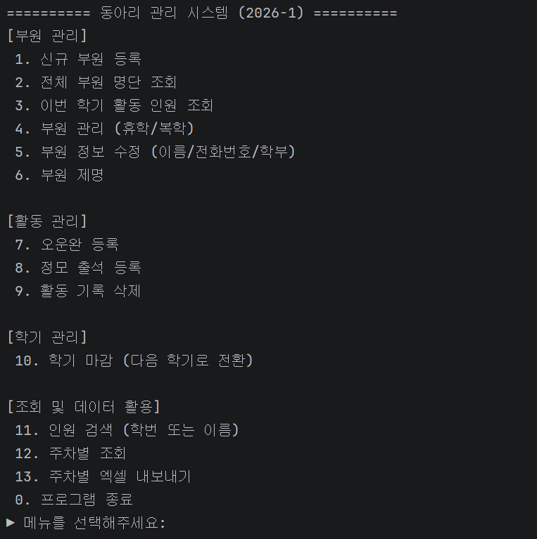
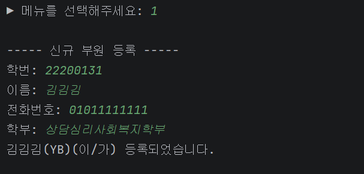
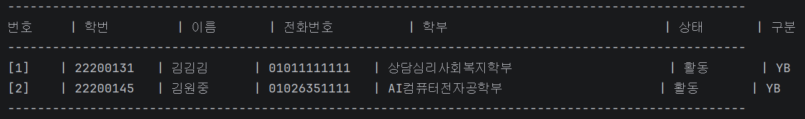
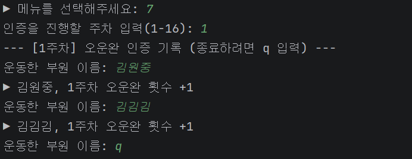
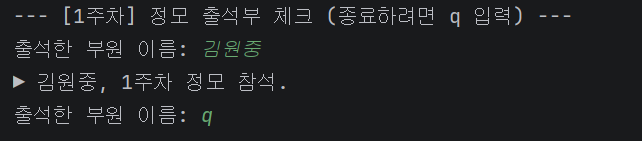
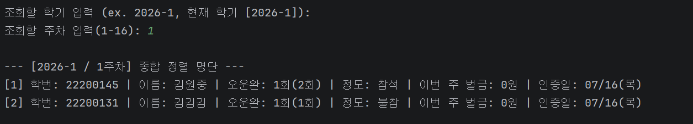
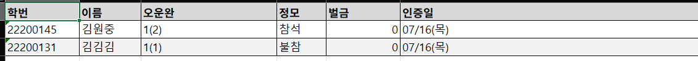

# 동아리 출석 관리 시스템

## 1. 프로젝트 주제 및 소개
해당 프로젝트는 Java 기반 CRUD 미니 프로젝트로, Java 기반의 기본 개발 흐름을 익히기 위한 학습 프로젝트의 일환입니다.  
해당 프로그램은 동아리원의 정보(학번, 이름, 전화번호, 학부, 활동 상태)와 주차별 활동을 관리하기 위한 목적으로 만들어졌습니다.

## 2. 주요기능
**부원 관리**
- 신규 부원 등록
- 전체 부원 명단 및 이번 학기 활동 인원 조회
- 부원 정보 수정(이름, 전화번호, 학부)
- 휴학, 복학 처리
- 부원 제명  

**활동 관리**
- 오운완 인증 등록
- 정모 출석 등록
- 활동 기록 삭제  

**활동 기록 조회**
- 학번/이름으로 검색, 학기별 활동 내역 조회
- 주차별 전체 활동 인원 조회
- 주차별 활동 기록 엑셀 파일로 내보내기

**학기 관리**
- 학기 마감 및 다음 학기로 전환
  - 미참여자는 휴학 상태로 처리  

**벌금 계산**
- 정모 불참 2회 면제, 3회부터 5,000원 등비수열로 증가
- 오운완 미인증 2주 면제, 3주째부터 5,000원 등비수열로 증가  

## 3. 사용 기술 및 버전
Language | Java17  
Database | MariaDB  
JDBC Driver | mariadb-java-client 3.3.3  
엑셀 라이브러리 | Apache POI (poi-ooxml 5.2.5)  
Container | Docker, Docker Compose  
IDE | IntelliJ

## 4. 프로젝트 구조
java-crud-samson-won/  
docs/images/
src/java/com/example/attendance  
&ensp;&ensp;&ensp;&ensp;model/  
&ensp;&ensp;&ensp;&ensp;&ensp;&ensp;&ensp;&ensp;&ensp;&ensp;Attendance  
&ensp;&ensp;&ensp;&ensp;&ensp;&ensp;&ensp;&ensp;&ensp;&ensp;Member  
&ensp;&ensp;&ensp;&ensp;repository/    
&ensp;&ensp;&ensp;&ensp;&ensp;&ensp;&ensp;&ensp;&ensp;&ensp;AttendanceArrayListRepository  
&ensp;&ensp;&ensp;&ensp;&ensp;&ensp;&ensp;&ensp;&ensp;&ensp;AttendanceDbRepository  
&ensp;&ensp;&ensp;&ensp;&ensp;&ensp;&ensp;&ensp;&ensp;&ensp;AttendanceFileRepository  
&ensp;&ensp;&ensp;&ensp;&ensp;&ensp;&ensp;&ensp;&ensp;&ensp;AttendanceRepository  
&ensp;&ensp;&ensp;&ensp;&ensp;&ensp;&ensp;&ensp;&ensp;&ensp;MemberArrayListRepository  
&ensp;&ensp;&ensp;&ensp;&ensp;&ensp;&ensp;&ensp;&ensp;&ensp;MemberDbRepository  
&ensp;&ensp;&ensp;&ensp;&ensp;&ensp;&ensp;&ensp;&ensp;&ensp;MemberFileRepository  
&ensp;&ensp;&ensp;&ensp;&ensp;&ensp;&ensp;&ensp;&ensp;&ensp;MemberRepository  
&ensp;&ensp;&ensp;&ensp;service/  
&ensp;&ensp;&ensp;&ensp;&ensp;&ensp;&ensp;&ensp;&ensp;&ensp;AttendanceService  
&ensp;&ensp;&ensp;&ensp;util/  
&ensp;&ensp;&ensp;&ensp;&ensp;&ensp;&ensp;&ensp;&ensp;&ensp;DBConnection  
&ensp;&ensp;&ensp;&ensp;&ensp;&ensp;&ensp;&ensp;&ensp;&ensp;ExcelExporter  
&ensp;&ensp;&ensp;&ensp;view/  
&ensp;&ensp;&ensp;&ensp;&ensp;&ensp;&ensp;&ensp;&ensp;&ensp;ConsolveView  
&ensp;&ensp;&ensp;&ensp;Main  
&ensp;&ensp;resources/  
&ensp;&ensp;&ensp;&ensp;db.properties  
&ensp;&ensp;&ensp;&ensp;db.properties.example   
.gitignore  
docker-compose.yml  
pom.xml  
Readme.md  
schema.sql  

## 5. 실행 방법
1. 프로젝트 클론 > db.properties.example을 참고해 db.properties 생성
2. Maven 빌드: mvn clean install
3. Main 클래스 실행    
**파일/DB버전 전환**  
파일버전: 'Main.java'에서 파일 버전 주석 제거, DB 버전 주석 처리  
DB버전: 'Main.java'에서 DB 버전 주석 제거, 파일 버전 주석 처리  
## 6. Docker 실행 방법
docker compose up -d # MariaDB 컨테이너 실행  
docker compose down # 컨테이너 종료(데이터는 volume에 유지됨)  
docker exec -it java-crud-mariadb mariadb -u club_user -p attendance_db #프롬프트에서 schema.sql 내용 붙여넣기
## 7. 테이블 구조
- members: 부원 정보 (student_id(학번)을 pk로 설정)  
- attendance: 주차별 활동 기록(id-PK)
- workout_dates: 오운완 인증 날짜(attendance 1건 당 여러 날짜 가능,attendance_id FK + CASCADE)  

## 8. 주요 기능 실행 예시
1. 메뉴  

2. 부원 등록  

3. 전체 명단 조회  

4. 오운완 등록  

5. 정모 참여 등록  

6. 주차별 조회  

7. 엑셀 내보내기  

## 9. Git Branch 전략
main: 최종 제출 브랜치  
develop: 개발 브랜치  
&ensp;&ensp;feature/memory-crud: 메모리 버전  
&ensp;&ensp;feature/csv: 파일 csv 저장 버전  
&ensp;&ensp;feature/DB: DB 저장 버전
&ensp;&ensp;feature/multi: 학생 정보, 출석 저장 기능

## 10. 인터페이스 기반 설계를 선택한 이유
MemberRepository/AttendanceRepository를 인터페이스로 먼저 정의하고, Service가 인터페이스 타입을 의존하도록 설계했습니다.  
해당 방식으로 메모리 > 파일 > DB로 저장방식을 바꾸는 동안 AttendanceService와 ConsoleView의 코드는 수정하지 않고, Main.java에서 구현체만 변경할 수 있었습니다.  
이는 OCP 실습이자, Spring이 자동으로 의존성을 주입해주는 것을 직접 구현해본 것으로 볼 수 있습니다.  

## 11. 개발 중 어려웠던 점과 해결 방법
1. 처음 만드는 도중, 학기 개념을 넣지 않아 주차가 겹쳤습니다  
현재 Attendance에 semester 필드가 있지만, 이전에는 학기 데이터가 없었습니다.  
이는 다음 학기로 넘어갈 때 1주차 기록과 섞여서 운동 기록, 벌금 문제 등 여러 문제가 발생할 수 있었고, semester 필드를 추가해 조회를 할 때마다 학번, 학기, 주차 별로 찾도록 했습니다.  
2. 학기 상태가 초기화 되는 문제  
semester를 만들기 이전 2026-1을 기본으로 설정했는데, 16주차 이후 다음 학기로 넘어갔지만, 프로그램을 다시 실행하면 2026-1로 돌아가는 문제가 있었습니다.  
이는 semester.txt에 현재 학기를 저장하고, 시작할 때 읽어오도록 하는 방법으로 해결했습니다.  
3. 정모, 운동 인증을 완전히 안한 주차가 벌금 계산에서 제외되던 문제  
calculateFine()이 존재하는 기록으로만 벌금을 계산했습니다. 그래서 오운완과 정모 참여를 아예 하지 않은 사람은 그 주의 기록 자체가 생기지 않아, 벌금 계산에 아예 포함되지 않았습니다.  
이는 1주차부터 현재 주차까지 전부 순회하면서, 기록이 아예 없으면 오운완과 정모 참여 모두 미인증, 결석 처리하도록 바꾸어 해결했습니다.

